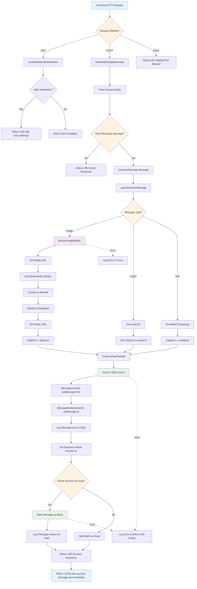

# Webhook.ts Flow Chart

## Key Components

### Verification Flow (GET requests)
- Validates webhook with `hub.mode`, `hub.verify_token`, and `hub.challenge`
- Returns challenge token if valid, 403 if invalid

### Message Processing Flow (POST requests)
1. **Validation**: Checks if request contains valid WhatsApp message
2. **Message Extraction**: Extracts WhatsApp message data
3. **Media Processing**: 
   - Images: Downloads, converts to base64, uploads to Supabase
   - Audio: Uses audio ID directly
   - Text: No media processing
4. **Payload Creation**: Creates standardized AnisaPayload
5. **Queue Dispatch**: Sends to SQS with deduplication
6. **Read Receipt**: Marks message as read in WhatsApp
7. **Response**: Returns success confirmation

### Error Handling
- Media processing errors are logged and thrown
- SQS/WhatsApp API errors are caught and logged, but return 200 to prevent webhook retries
- Always returns 200 status to acknowledge receipt to WhatsApp